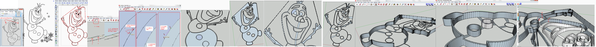

# fablab
example for making a cookie 'pastry cutter' from black and white picture.
__Inkscape__ ==> vectorize to __.dxf__ 
==> __Sketchup__ line and push, to __.stl__ 
==> slic3r to __.gcode__ ==> 3D printed stuff

#. find a black and white coloring picture
 Possibly remove the unnecessary element with you prefered picture editor (mine : Paint.net : simple efficient). 
 Possibly add a line to surround too thin lines like arms of a fellow pic.
#. past it in Inkscape (free software) 
 Vectorise the Bitmap (Shift+Alt+B) : it creates a second object
 Move the object so that you can delete the original image, and keep the vertor group. 
 Remark for Inkscape behavior : to select an object, press 'Space bar' to neable the selaction Tool (if not).
 [optional] simplify the number of edges : Double clic on the vector group, (when red lines appear around the black lines, that's OK). To simplify : Crtl+L, multiple times if needed. If too much, undo.. (possibly a bad idea : lines get less straight)
Save as .dxf 
#. Now in Sketchup, import the .dxf created file
 Ctrl+Shift+E ==> Zoom fit
 Orbit around : Middle clic (not released) 
 Pan around : Shitf+ Middle clic (can be done in the same action as orbit)
 for convenience : select the object, Right mouse button -> Explode the group
 At that point you have no shape, only connected edges.
 Now start the manual work. 
 Search defect lines : Zoom in (Ctrl+Scrool, pointing at where you want to zoom ) 
 Remove unwanted edges if needed.	
 draw a line on top of edge to generate shape
 create reinforcement path to stick floating pieces.
 many manual 'L' clic,clic 'Space' clic(select) delete

#. Before the push action, save your file as a backup, once many shapes are pushed, it's harder to make modifications. So start afresh from here.
 Finaly the push ('P' key) actions
    type 'P' then '30' it writes 30 in the bottom right corner, then hit 'Return'
    i chose 30 [mm] for the outer frame, 20 for the inner inprint, and 2 for the reinforcement structure. We'll if it's strong enough later.
    go behind the model to verify that th bottom shape is not missing (possible if you have deleted some push surfaces, or 'pit shape' that was not separated from the main bottom shape). If so, then, line again, to reform the missing shapes
 When you ars satisfied, using the (Sketchup->Window->extensionWarehose->Search : ) SketchUp STL plugin. {_TODO_: File->export STL} (dunno why it's not integratate, into the File->SaveAs .stl possiblilty, that's another discussion)
 then try to import the .stl with slic3r or kisslicer